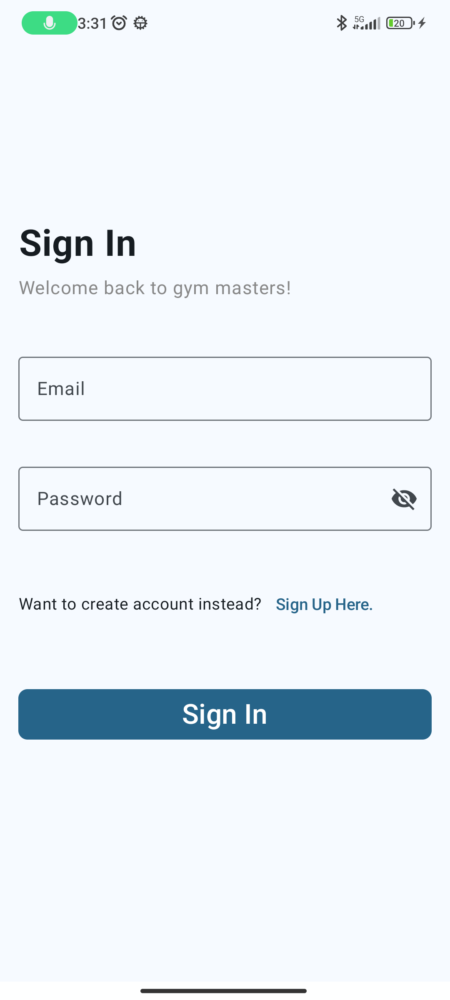
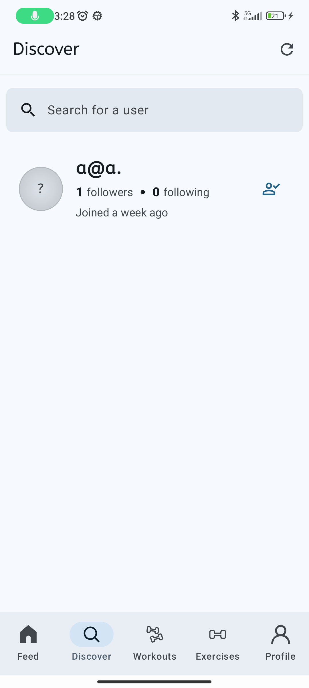
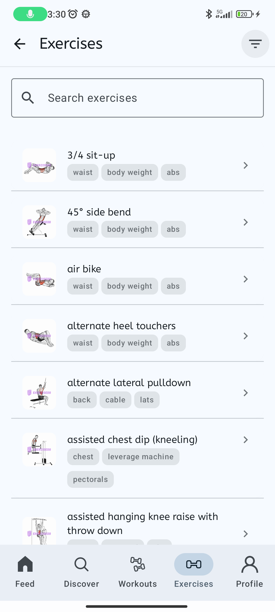
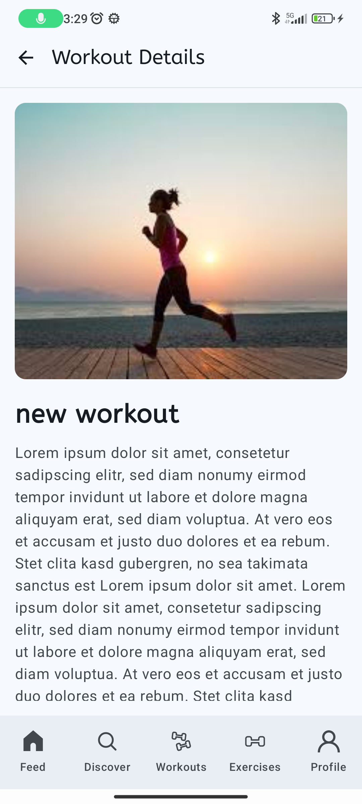
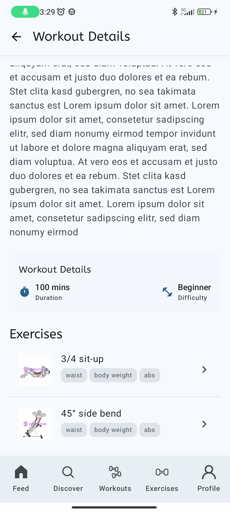
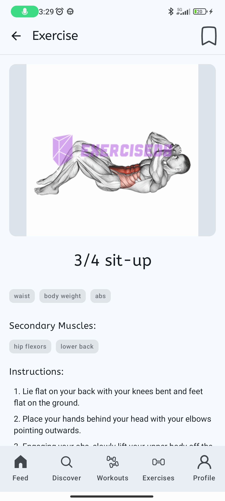
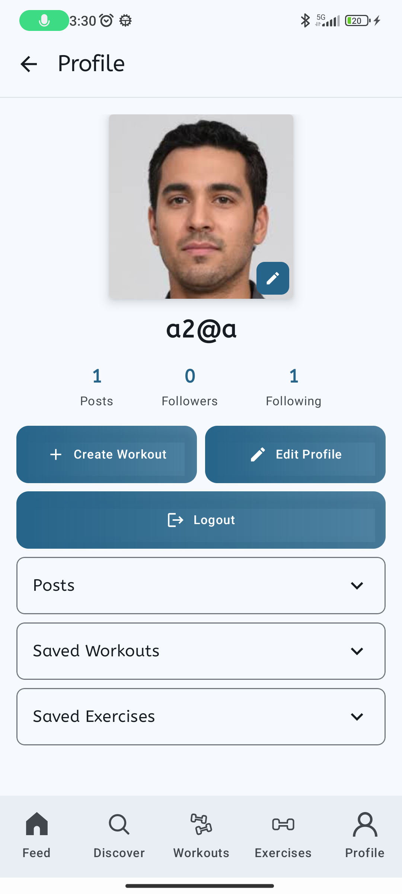
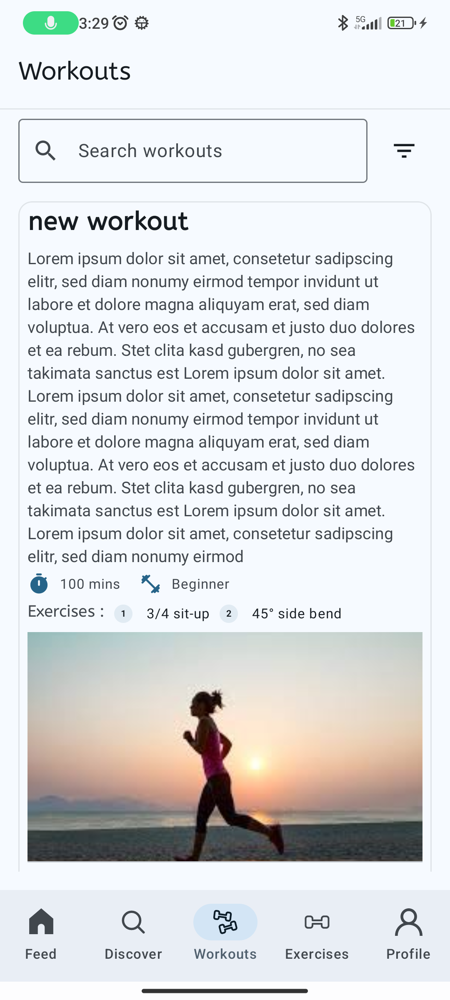
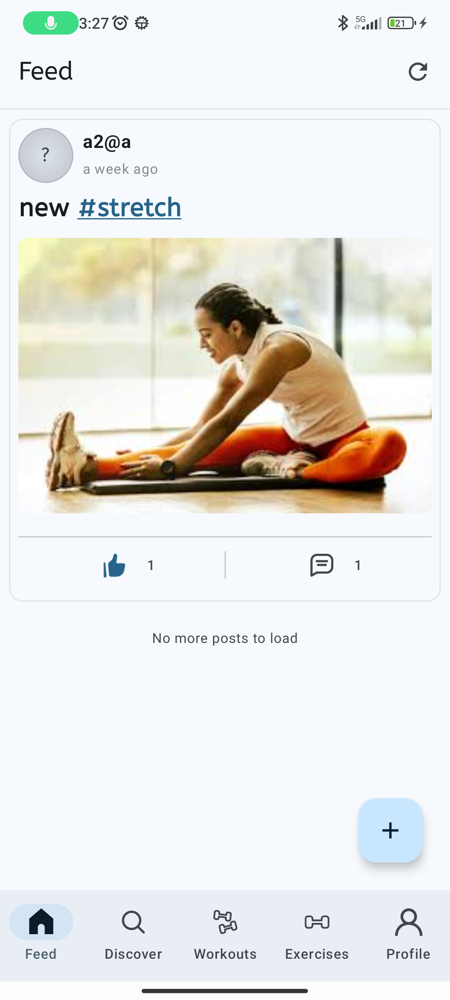
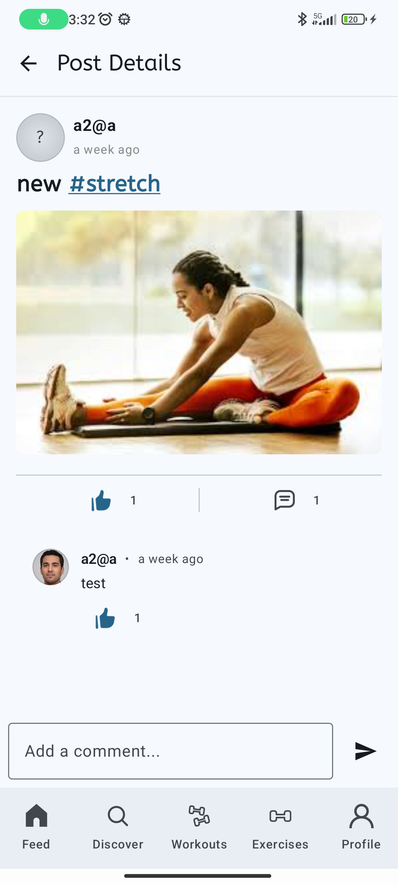

# Gym Masters 

## Overview

The application manages various data types including user profiles, posts, comments, exercises, workouts, likes, and social connections. It employs a hybrid approach using:

1.  **Cloud Firestore:** Primary remote NoSQL database for dynamic, structured data like user information, posts, comments, likes, follows, workouts, and hashtags. Used for real-time updates where needed.
2.  **Firebase Authentication:** Handles user authentication (signup, sign-in, session management).
3.  **Firebase Storage:** Stores user-uploaded media like profile pictures, post images, and workout cover images.
4.  **Room Database:** Local persistence library for:
    *   Caching large datasets fetched initially (Exercises, Body Parts, Equipment, Targets).
    *   Managing offline data or user-specific saves (Saved Workouts, Saved Exercises - based on flags/tables).
    *   Handling optimistic UI updates and synchronization for actions like Likes (`CachedLike` table).
5.  **External API (ExerciseDB):** Used by `ExerciseRepository` to fetch the initial, comprehensive list of exercises during first app launch.

> **Note:** On instruction on how to setup the Firebase project, please refer to the [Firebase Project Setup](PROJECT_SETUP.md).  

> **Note:** To get a better understanding of how app and database is structured, please refer to [App Structure](APP_STRUCTURE.md).

## App Feature Showcase

This section highlights some of the core features of the Gym Masters app.

### 1. User Authentication
- Sign In to access your account.

  

### 2. Discover New Users
- Explore new users in the community.

  

### 3. Browse Exercises
- Browse the catalog of exercises.

  

### 4. Workout Details
- View detailed information about workouts

  
  

### 5. Exercise Details
- Explore detailed information about exercises.

  

### 6. User Profiles
- View profiles

  

### 7. Explore Workouts
- Explore different workouts

  

### 8. Post Feed
- View workout feed.

  

### 9. Interact with Posts
- Like and comment on posts.

  
